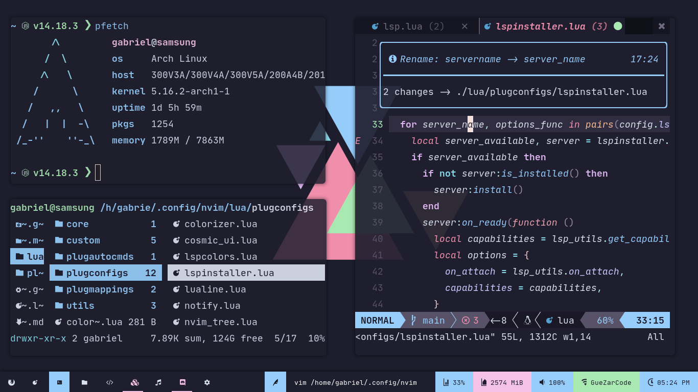
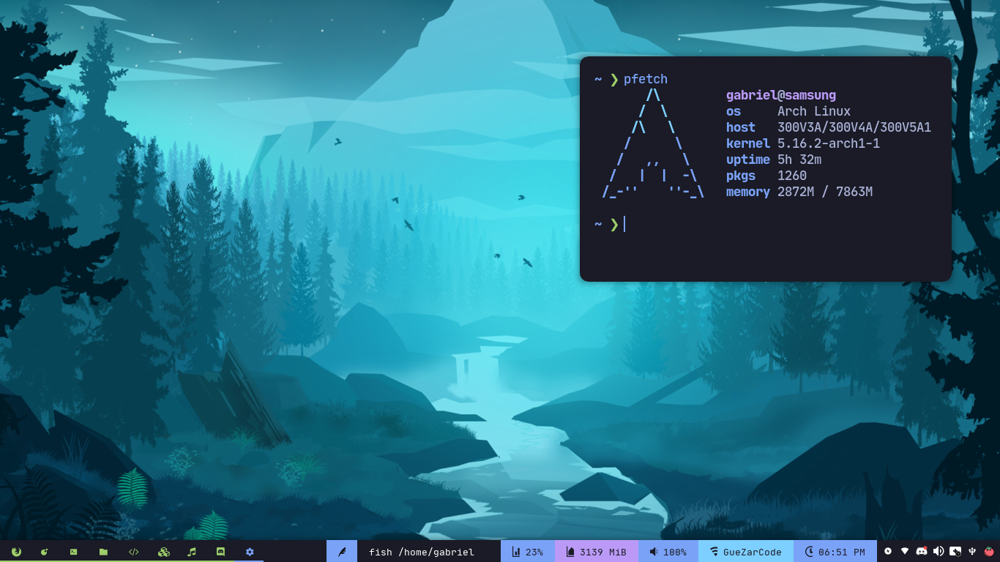

# Bspwm Dotfiles

My Configuration files for my new bspwm setup



## Note

If you like this configuration, you can give me a star pls :)

You really make me happy if you do it :D

## Requirements

I am using Arch Linux, but I expect you have it, to make all work

- JetBrainsMono Nerd Font
- alacritty
- kitty (optional, but alternative to alacritty)
- rofi
- sxhkd
- bspwm
- polybar
- picom
- feh
- fish
- starship
- yarn
- bat
- exa

## Installation

To install you can use this commands

```sh
git clone https://github.com/AlphaTechnolog/bspwm-dotfiles ~/.bspwm-dotfiles
cd ~/.bspwm-dotfiles
mkdir -p ~/.config
mkdir -p ~/.local/share
cp -r ./.config/* ~/.config
cp -r ./.local/share/* ~/.local/share
```

## Misc

### Wallpaper

#### Catppuccin


#### Tokyonight


### Gallery

#### Catppuccin


#### Tokyonight

